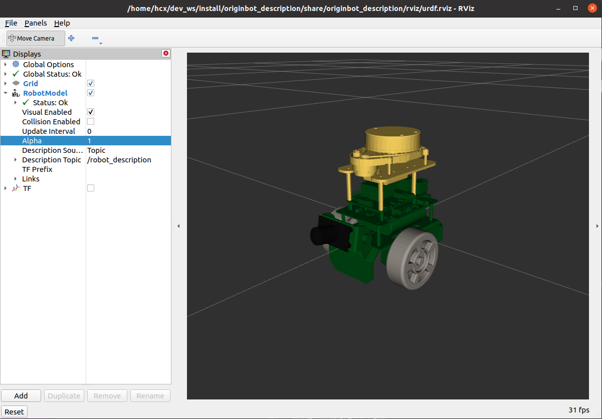
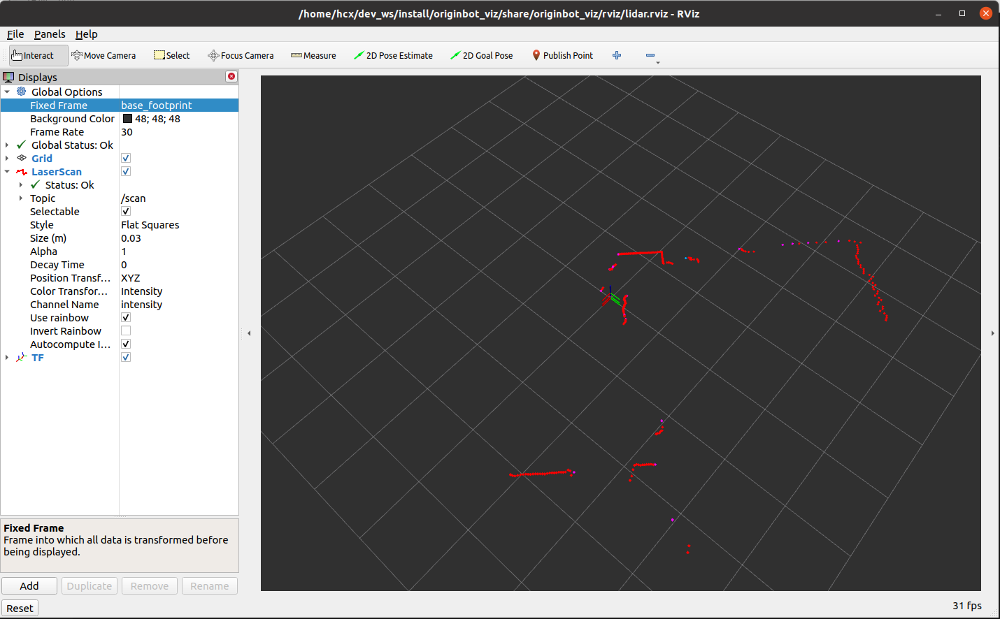
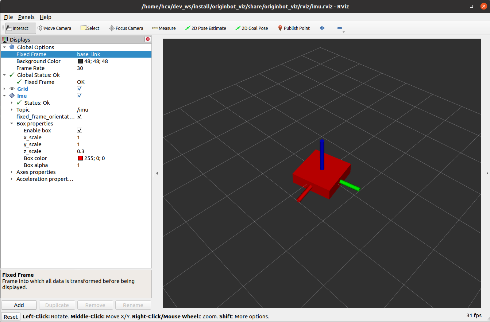
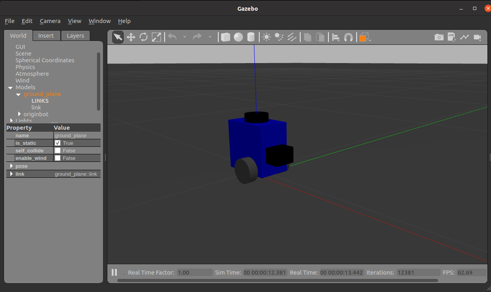
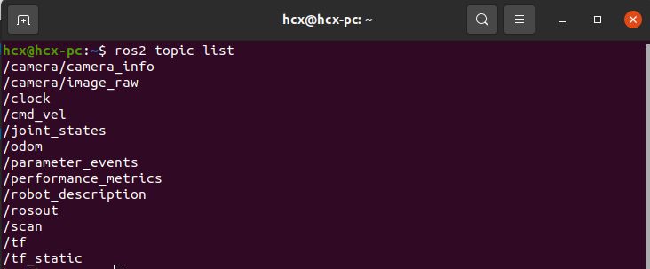
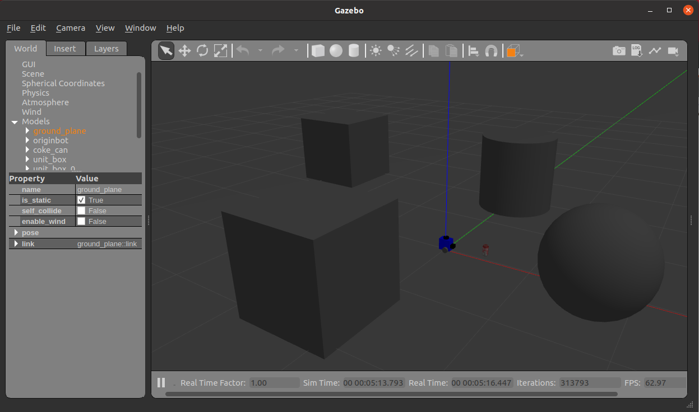
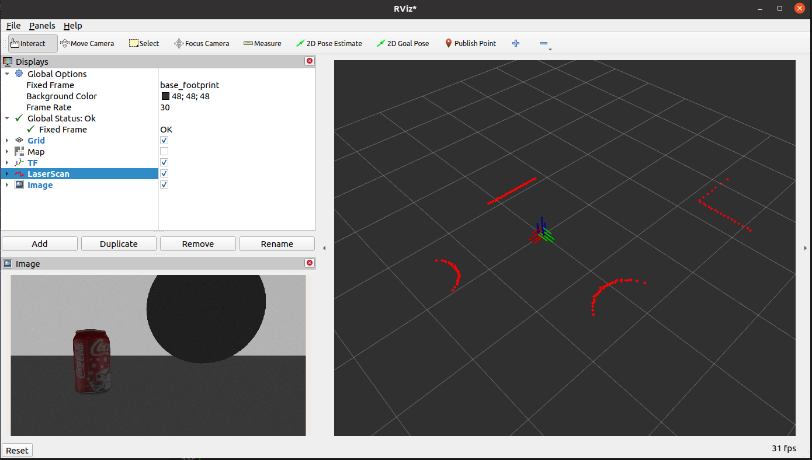

# OriginBot智能机器人开源套件（PC端功能包）


OriginBot是一款智能机器人开源套件，更是一个社区共建的开源项目，旨在让每一位参与者享受机器人开发的乐趣。

## 项目链接

### 项目主站

[https://www.originbot.org/](https://www.originbot.org/)

### 源码仓库

| 代码仓库                                                         | 说明                        |
| ------------------------------------------------------------ | --------------------------- |
[originbot ](https://gitee.com/guyuehome/originbot) | originbot机器人端功能包仓库 |
[originbot_desktop](https://gitee.com/guyuehome/originbot_desktop) | originbot电脑端功能包仓库   |
[originbot_controller](https://gitee.com/guyuehome/originbot_controller) | originbot控制器源码仓库     |

### 论坛交流

[https://guyuehome.com/Bubble/circleDetail/id/95](https://guyuehome.com/Bubble/circleDetail/id/95)


## 软件架构

- originbot_description: 机器人模型及加载脚本
- originbot_viz: 机器人上位机可视化显示功能包
- originbot_demo：机器人基础功能的编程示例
- originbot_gazebo: 机器人仿真模型与环境
- originbot_msgs: OriginBot自定义通信接口
- originbot_app：OriginBot可视化上位机
- originbot_deeplearning: 机器人深度学习功能
    - line_follower_model：AI视觉巡数据采集与模型训练功能包
    - 10_model_convert: 模型转换脚本


## 操作简介
详细操作说明请参考：[https://www.originbot.org/](https://www.originbot.org/)

### 查看机器人可视化模型

#### PC端

```bash
$ ros2 launch originbot_description display.launch.py
```



### 查看机器人雷达雷达可视化数据

```bash
$ ros2 launch originbot_viz display_lidar.launch.py
```

即可看到可视化的雷达信息：



### 查看IMU可视化数据

```bash
$ ros2 launch originbot_viz display_imu.launch.py
```

即可看到可视化的雷达信息：



### 查看机器人TF关系

```bash
$ ros2 launch originbot_viz display_robot_tf.launch.py
```


### 查看机器人SLAM可视化过程

```bash
$ ros2 launch originbot_viz display_slam.launch.py
```


### 监控机器人导航可视化过程

```bash
$ ros2 launch originbot_viz display_navigation.launch.py
```


### 虚拟仿真

#### PC端依赖安装
```bash
$ sudo apt install ros-foxy-gazebo-ros
$ sudo apt install ros-foxy-gazebo-ros2-control
$ sudo apt install ros-foxy-gazebo-plugins
$ sudo apt install ros-foxy-ros2-control
$ sudo apt install ros-foxy-ros2-controllers

```

#### 运行仿真环境
```bash
$ ros2 launch originbot_gazebo originbot_gazebo.launch.py
```



#### 查看仿真话题列表

```bash
$ ros2 topic list
```



#### 控制机器人运动
```bash
$ ros2 run teleop_twist_keyboard teleop_twist_keyboard
```


#### 查看相机与雷达可视化数据
在仿真环境中放入一些障碍物：



```bash
$ ros2 run rviz2 rviz2
```



## 参与贡献

诚挚邀请各位开发者可以参与到OriginBot项目当中来，参与的方式和形式有很多种：


### **提供反馈**

- 在使用OriginBot套件的过程中，如有任何问题或者建议，欢迎在[古月居社区版块](https://guyuehome.com/Bubble/circleDetail/id/95)提问讨论；

- 在使用OriginBot软件的过程中，如有发现任何bug，欢迎在[代码仓库](https://gitee.com/guyuehome/originbot)中提交Issue；

  

### **贡献代码**

- 在使用OriginBot套件的过程中，如对原生代码有优化、增加等修改，欢迎在[代码仓库](https://gitee.com/guyuehome/originbot)中提交Pull Request；

  

### **开源传递**

- 如果你对OriginBot有兴趣，欢迎点赞该项目的源码仓库，或者分享给身边有需要的开发者；

- 如果基于OriginBot开源项目衍生出更多有意思的功能或者机器人，欢迎在[社区板块](https://guyuehome.com/Bubble/circleDetail/id/95)中与大家分享，优秀的项目我们也会在社区中宣传；

